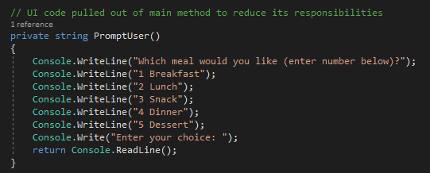
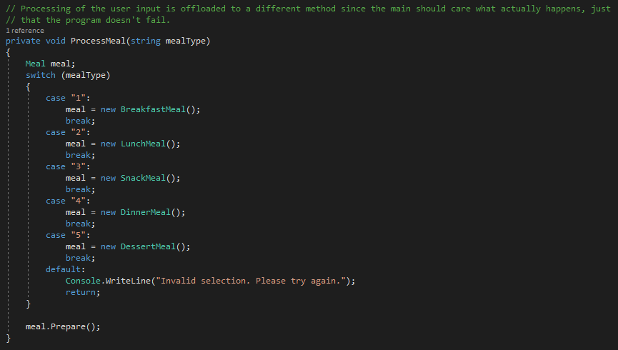
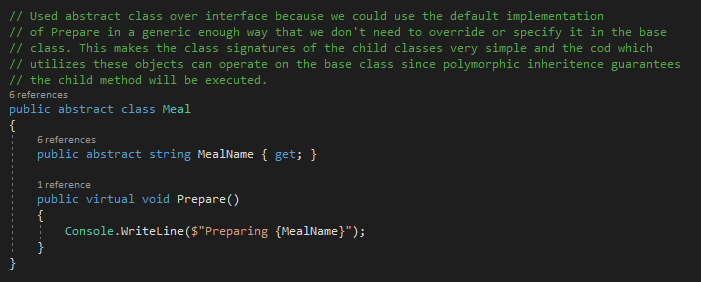

# DPC: Factories - Lesson 1

We were tasked with taking an existing piece of code and refactoring it to a more maintainable module. The code
in question was a manager responsible for creating, updating, and deleting negotiations.

## Step 1: Identify Improvement Opportunities

The main application method is doing everything including prompting the user, processing their input, and replying with the necessary information.
- Extract user interface code to it's own method
- Extract input handling to it's own method
- Create meal abstractions to reduce code duplication and create the start of an organized codebase  
  - Option A: Interface
  - Option B: Abstract Class       
  - **Which would you choose?**

## Step 2: Refactor to Ensure Easier Conversion to Factory

### Extract User Interface code

### Extract Input Handling

### Abstraction

## Step 3: Create Factory